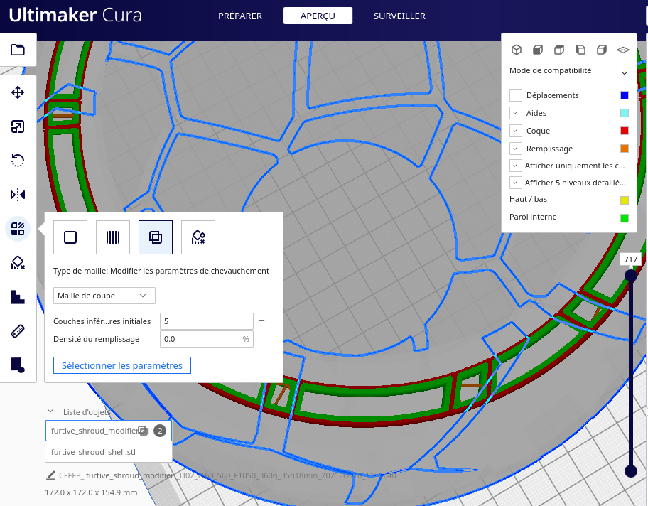

Salutation !

Je suis tombé sous le charme de 
[Furtive Shroud (Tealight holder - Voronoi)](https://www.youmagine.com/designs/furtive-shroud-tealight-holder-voronoi)
par [voidbubble](https://www.youmagine.com/voidbubble)

Et je voulais partager et détailler l'utilisation les modificateurs de paramètres de chevauchement sous Ultimaker Cura (version 4.12.1)

C'est en gros le même principe que pour l'utilisation des "Blocage des supports (E)"
mais sur un objet 3D quand on utilise deux ou plusieur objet 3D pour modifier les paramétres de tranchage sur des zones spécifique de l'un de ces objet.

Voir la vidéo Youtube 
[3 Cura Slicer Setting Tricks For Beginners](https://www.youtube.com/watch?v=su_m5zV9rvA&t=136s)
de [CHEP](https://www.youtube.com/channel/UCsdc_0ZTXikARFEn2dRDJhg)

## Placements

Comme on part de deux fichiers .stl (un pour l'objet en lui même et l'autre pour définir les zones du modificateur )
il faut bien prendre le temps de les positionner correctement.

## Application d'un modificateur des paramètres de cheuvauchement sur un objet

### Maille de coupe
Maille de coupe va s'appliquer sur l'ensemble des partie en superpositions

### Maille de remplisage
Maille de remplisage ne vas s'appliquer que sur les parties de remplisage.

